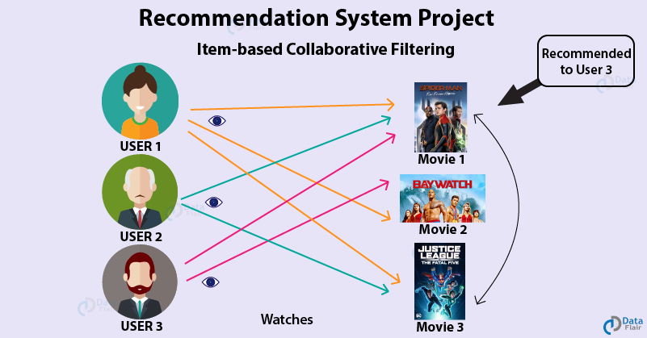

# Project 4: Algorithm implementation and evaluation: Collaborative Filtering

### [Project Description](doc/project4_desc.md)

Term: Fall 2019

+ Team Section1 Group4
+ Projec title: Collaborative Filtering Implementation And Evaluation 


+ Team members
	+ Chongyu He (ch3379)
	+ Daniel Lee (dl3250)
	+ Yiwen Ma (ym2775)
	+ Runzi Qiang (rq2156)
	+ Yifan Yang (yy2955)
+ Project summary: 
We worked on building a content filtering method for the recommendation system, using Stochatic Gradient Descent algorithm. Tempoeral regularization was usd for regularization and for postprocessing, SVD with KNN and SVD with kernel ridge regression was used.
Our group’s goal is to see the difference between the two models:
	- SGD algorithm with temporal regularization and postprocessing SVD with KNN
	- SGD algorithm with temporal regularization and postprocessing SVD with kernel ridge regression

	

**Contribution statement**: 
+ Chongyu He 
+ Daniel Lee: Converted starter code from R to Python, implemented static temperal dynamics algorithm, organized github
+ Yiwen Ma: Designed and implemented entire architecture,including matrix factorization(SGD),regularization(Temperal dynamics),postprocessing(KNN and Ridge). Trained and tested the model, parameter tuning.

+ Runzi Qiang: Implemented KNN, arrange group meetings, help understanidng the algorithms.
+ Yifan Yang: Implemented the starter code of stochastic gradient descent, regularization and matrix factorization. 


Following [suggestions](http://nicercode.github.io/blog/2013-04-05-projects/) by [RICH FITZJOHN](http://nicercode.github.io/about/#Team) (@richfitz). This folder is orgarnized as follows.

```
proj/
├── lib/
├── data/
├── doc/
├── figs/
└── output/
```

Please see each subfolder for a README file.
